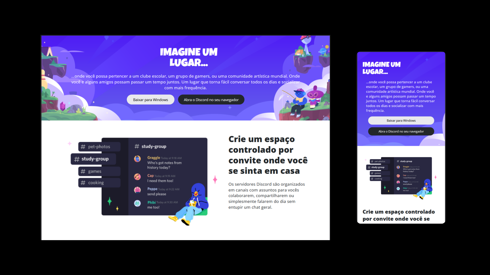

# Clone página Discord
Desafio de responsividade da formação CSS da DIO.
Desenvolver uma pagina estática do site Discord a partir do layout disponibilizando no Figma.Tendo como desafio deixar a página responsivel,utlizando flexbox,grid e media query.

## Tecnologias

## Demonstração

https://orlandoseven.github.io/Desafio-Responsividade/
